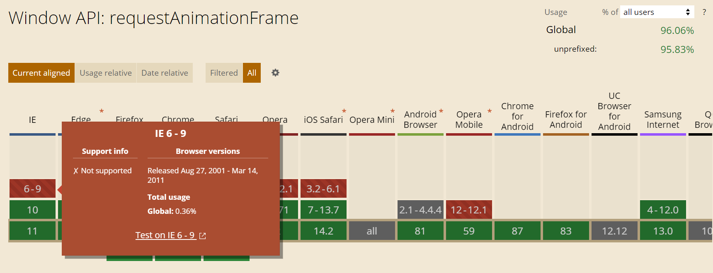

# 动画的基本概念

## 动画就是运动
> 动画本质上是图像按照事先设定好的顺序在一定的时间内的`动画序列变化运动`，而运动是一个物体随着时间在空间中改变它的位置；
>这种`动画序列变化运动`给我们最为直观的感受彷佛真实的在运动一般，从而产生动画效果。

## 帧
为什么这种`动画序列变化运动`在我们人眼看来就彷佛真实的在运动一般呢？

因为~~我们不是上帝哈~~
人的眼睛是有欺骗性的，你所看到的动画无非是你的眼睛在欺骗你的大脑，本质上每一张图像还是那张图像，只不过它们在单位时间内按照一定的顺序在快速移动罢了。

这些图像就是我们所说的`帧(Frame)`，我们通常说`帧数`，简单地说，就是在1秒钟时间里传输的图像的`帧数`，也可以理解为图形处理器每秒钟能够刷新几次，通常用`fps（Frames Per Second）`表示。

## 程序帧

通常超过`24fps`时，人眼就不能区分出真假了。
所以一般电影只需要`24fps`就足够流畅了，而游戏需要`60fps`，我们设计动画时通常选用`60fps`，也就是我们所说的`程序帧`。

## 那我们怎么实现动画呢？

正如先前所说，如果我们能够在每16ms（1秒60帧，1000/60）内渲染1张图像，并且每一张图像的内容发生微调，那么在1秒钟整个画面就会产生动画效果了。

这不就是定时任务吗？
[window.setInterval()][setInterval]是不是就能实现？
```
function draw(){
    ....
}
window.setInterval(draw, 16)
```
那[window.setTimeout()][setTimeout]能不能实现呢？
```
function draw(){
    ....
    window.setTimeout(draw, 16)
}
window.setTimeout(draw, 16)
```
能够实现吗？看代码好像是可以的，不就是每16s执行一下吗？

但JS引擎是单线程的，在某一个特定的时间内只 能执行一个任务，并阻塞其他任务的执行，也就是说这些任务是串行的。详情见[JavaScript 运行机制](http://www.ruanyifeng.com/blog/2014/10/event-loop.html)

使用`setTimeout/setInterval`会出现不准时的问题，说好的 16 秒后执行，但是可能在 18 秒执行。还可能存在以下问题：
>- 动画作者对帧数没有掌控
>- 当标签是隐藏状态（非当前显示的）时，无谓地消耗系统资源
>- setInterval 对自己调用的代码是否报错漠不关心。即使调用的代码报错了，它依 然会持续的调用下去（可以用 setTimeout 解决）

由于这些问题，所以我们有了[requestAnimationFrame][requestAnimationFrame]

## requestAnimationFrame
>[window.requestAnimationFrame()][requestAnimationFrame] 告诉浏览器——你希望执行一个动画，并且要求浏览器在下次重绘之前调用指定的回调函数更新动画。该方法需要传入一个回调函数作为参数，该回调函数会在浏览器下一次重绘之前执行

类似于 setTimeout 定时器，同样的，若你想在浏览器下次重绘之前继续更新下一帧动画，那么回调函数自身必须再次调用[window.requestAnimationFrame()][requestAnimationFrame]
```
(function drawFrame(){
    window.requestAnimationFrame(drawFrame);
    
    //some code for animation effect here
})();

上面的代码意思是立即执行drawFrame这个函数，发现  window.requestAnimationFrame(drawFrame)，根据浏览器的刷新频率(不同显示器刷新频率不一样60Hz或75Hz)，在一定时间之后执行；
接下来执行你所编写的改变图像内容（图像的位置、宽高、颜色等等）的脚本，执行回调；
循环反复，形成动画效果
```
当然这个API是有兼容性问题的，不过新版的浏览器基本上都支持，[https://caniuse.com/?search=requestAnimationFrame](https://caniuse.com/?search=requestAnimationFrame)


```
当部分浏览器不兼容这个API时，我们也可以写成以下形式：

if(!window.requestAnimationFrame){
    window.requestAnimationFrame = (
      window.webkitRequestAnimationFrame || 
      window.mozRequestAnimationFrame ||
      window.msRquestAniamtionFrame ||
      window.oRequestAnimationFrame || 
      function (callback){
          return setTimeout(callback,Math.floor(1000/60))
    }
  )
}

```


[setInterval]:https://developer.mozilla.org/zh-CN/docs/Web/API/Window/setInterval
[setTimeout]:https://developer.mozilla.org/zh-CN/docs/Web/API/Window/setTimeout
[requestAnimationFrame]:https://developer.mozilla.org/zh-CN/docs/Web/API/Window/requestAnimationFrame